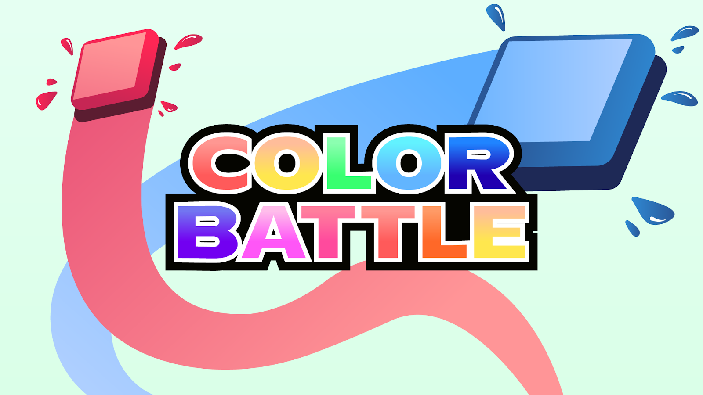

  

  # Pong: Color Battle

  **A two-player Pong remix with selectable powers, sound, and first-to-seven arcade matches.**

## About

Color Battle starts with classic local multiplayer Pong and gives each paddle a special color ability. Paddle hits charge a power meter; once charged, a player can reverse the ball, accelerate it, create a shield, enlarge their paddle, or briefly hide the ball. The first player to seven points wins.

## Features

- Local two-player matches
- First-to-seven scoring
- Full-screen presentation and menu system
- Five selectable paddle powers
- Charge meters and power activation
- Angled bounces, increasing speed, and wall collisions
- Bundled backgrounds, ball art, music, and sound effects
- Play-again, main-menu, options, and exit screens

## Controls

| Player | Move up | Move down | Activate power |
| --- | --- | --- | --- |
| Left paddle | <kbd>W</kbd> | <kbd>S</kbd> | <kbd>Q</kbd> |
| Right paddle | <kbd>↑</kbd> | <kbd>↓</kbd> | <kbd>→</kbd> |

## Color powers

| Color | Ability |
| --- | --- |
| White | Reverse the ball's direction |
| Red | Increase ball speed for a hit |
| Green | Create a protective shield |
| Blue | Increase paddle size |
| Yellow | Make the ball temporarily invisible |

## Run the game

1. Install [Processing 4](https://processing.org/download).
2. In Processing, install the **Sound** library from **Sketch → Import Library → Manage Libraries**.
3. Clone this repository.
4. Open `Jonathan_Sherman_pong/Jonathan_Sherman_pong.pde`.
5. Press **Run**.

Keep the `data/` directory beside the sketch because it contains the artwork and audio loaded at runtime.

## Built with

- Processing
- Processing Sound
- `PVector` movement
- Keyboard and mouse input
- State-based menus, powers, scoring, and match flow
